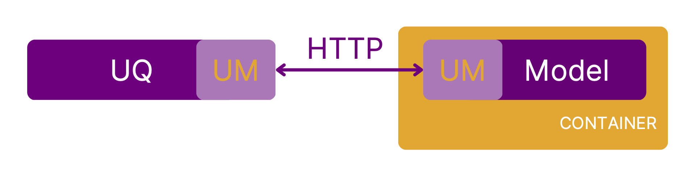

=================
Quickstart Guide
=================

Installation
===============

The benchmarks do not need to be installed. Each model and benchmark in this library is provided as a Docker image hosted on dockerhub and can be run with a single command, which you can find on the respective model's or benchmark's documentation page.

Running such a container requires Docker (available for all major operating systems at `www.docker.com <https://www.docker.com>`_).

Running a first model
===========================

We begin by starting the tsunami model from the benchmark library. To make it more interesting, we also mount the output directory specified in the model's documentation to a folder in our home directory. This will allow us later to conveniently access output files from the model::

    docker run -it -p 4242:4242 -v ~/tsunami_output:/output linusseelinger/model-exahype-tsunami

Replace the image name with ``model-exahype-tsunami-arm`` if you use an Arm-based machine.

Now the model is running, ready to be called by a client.

Calling the model from Python
==================================

One way to access the model is from Python. First install UM-Bridge support in Python via pip::

    pip install umbridge

Now, you can call the model by running the Python example ``umbridge-client.py`` from the `UM-Bridge repository <https://www.github.com/UM-Bridge/umbridge/tree/main/clients/python/>`_::

    python3 umbridge-client.py http://localhost:4242

This example triggers two runs of the model. The second one activates the model's VTK output. You can access the resulting files in the folder we mounted above in your home directory, and view them using a suitable tool like ParaView.

Alternative clients
========================

Any other UM-Bridge client can connect to the model as well, for example the c++ example in the UM-Bridge repository. You can even do a raw HTTP request using the `curl` command line tool::

    curl http://localhost:4242/Evaluate -X POST -d '{"name": "forward", "input": [[100.0, 50.0]], "config":{"vtk_output": true}}'
